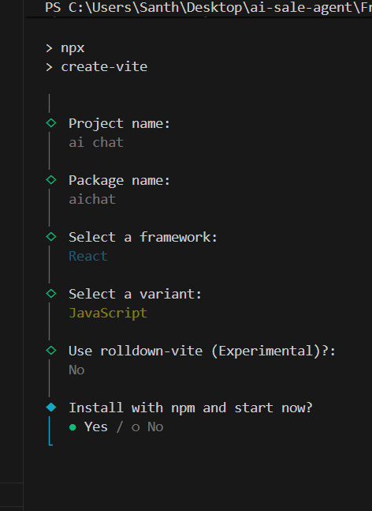

 Local:   http://localhost:5173/
S
run front end :npm run dev

cd frontend
npm create vite@latest

# choose React + JavaScript
npm install
npm run dev

frontend/
 ├── src/
 │   ├── App.jsx
 │   └── main.jsx
 └── package.json
